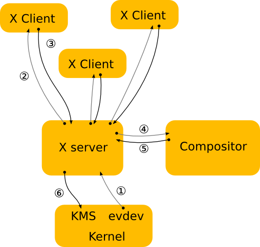

# INTRODUCTION 2

## System calls

System calls are the interface between the user space and the kernel space.  
They are used by the user space to request services from the kernel.  
The kernel provides a set of functions that can be called by the user space to perform tasks such as:

- process management
- file management
- memory management
- device management
- network management

System calls are implemented as functions in the kernel that can be called by user space programs.  
When a user space program makes a system call, the kernel switches from user mode to kernel mode to execute the system call.
these functions are a wrapper around the actual system call instruction that switches the CPU from user mode to kernel mode.

   ```bash
   man 2 syscalls
   ```

## Filder structure

every thing in linux is a file

1. /bin: contains essential command binaries
2. /etc: contains system-wide configuration files
3. /sbin: contains essential system binaries
4. /usr: contains user binaries and libraries
5. /var: contains variable data files(log, cache, temp etc)
6. /dev: contains device files
7. /home: contains user home directories
8. /lib: contains system libraries
9. /proc, /sys, /dev: doesn't exist on disk created in RAM by init process at boot time

## resolv.conf

`/etc/resolv.conf` is a configuration file for the DNS resolver.

the resolver refers to a library that consists of a collection of functions that does domain name translation.

DNS queries are the requests that are made to a Domain Name System (DNS) server for resolving a domain name into its corresponding IP address.

  ```bash
   cat /etc/resolv.conf
   ```

## fstab

`/etc/fstab` is a configuration file that contains information about all the partitions and storage devices in your system which should be mounted automatically at boot time.

   ```bash
   $ cat /etc/fstab
# /etc/fstab: static file system information.
#
# Use 'blkid' to print the universally unique identifier for a
# device; this may be used with UUID= as a more robust way to name devices
# that works even if disks are added and removed. See fstab(5).
#
# <file system> <mount point>   <type>  <options>       <dump>  <pass>
# / was on /dev/sda2 during installation
UUID=d538b03c-c5ad-45f5-902a-80e78a2842c3 /               btrfs   defaults,subvol=@,noatime,discard=async,ssd 0 1
# /boot/efi was on /dev/sda1 during installation
UUID=A241-53BA  /boot/efi       vfat    umask=0077      0       1
# /home was on /dev/sda2 during installation
UUID=d538b03c-c5ad-45f5-902a-80e78a2842c3 /home           btrfs   defaults,subvol=@home,noatime,discard=async,ssd  0       2
# swap was on /dev/sda3 during installation
UUID=22b987d3-2a98-4007-a0b6-5385bbc6d7dc none            swap    sw              0       0

UUID=0C660EA90C660EA9  /home/hala/windows-a         ntfs3   defaults,noatime,nofail,noauto,exec,user,x-systemd.device-timeout=5,comment=x-gvfs-show 0 0
UUID=44A0358DA0358708  /home/hala/windows-b         ntfs3   defaults,noatime,nofail,noauto,exec,user,x-systemd.device-timeout=5,comment=x-gvfs-show 0 0
   ```

### file content

  1.UUID: the universally unique identifier for the device.  
  you can use `blkid` command to get the UUID of a device.
  2.last two digits:
   **first digit**
   `1` dump utility backup of a partition.  
   `0` no backup. This is an outdated backup method and should NOT be used.
   **second digit**
   This controls the order in which fsck checks the filesystems at boot time. The root filesystem should have the highest priority `1`, and other filesystems should have `2`. If it is `0`, fsck will not check the filesystem.

## crontab

`crontab` is a command-line utility that allows you to schedule tasks to run at specific times.

  ```bash
   # open the crontab file for editing
   $ crontab -e
   # list the current crontab entries
   $ crontab -l
   # entry format example
   # Example of job definition:
   # .---------------- minute (0 - 59)
   # |  .------------- hour (0 - 23)
   # |  |  .---------- day of month (1 - 31)
   # |  |  |  .------- month (1 - 12) OR jan,feb,mar,apr ...
   # |  |  |  |  .---- day of week (0 - 6) (Sunday=0 or 7) OR sun,mon,tue,wed,thu,fri,sat
   # |  |  |  |  |
   # *  *  *  *  * user-name command to be executed
   m   h  dom mon dow  command
   0   *   *   *   *   DISPLAY=:0 XDG_RUNTIME_DIR=/run/user/$(id -u) notify-send "Hydration Reminder" "Don't forget to drink water!"

  ```

## uptime

`uptime` command displays the current time, how long the system has been running, how many users are currently logged on, and the system load averages for the past 1, 5, and 15 minutes.

  ```bash
  $ uptime
   09:48:48 up  9:18,  1 user,  load average: 0.33, 0.76, 1.23
  ```

`/proc/uptime` contains two numbers (in seconds):

1. The uptime of the system (time since last boot).
2. The amount of time the machine has spent idle.

  ```bash
   $ cat /proc/uptime
   33437.32 27168.44
  ```

## cmdline

`/proc/cmdline` contains the command line parameters passed to the kernel at boot time.

  ```bash
   $ cat /proc/cmdline
   BOOT_IMAGE=/@/boot/vmlinuz-5.15.0-91-generic root=UUID=d538b03c-c5ad-45f5-902a-80e78a2842c3 ro rootflags=subvol=@ quiet splash
  ```

## sources.list

`/etc/apt/sources.list` is a configuration file that contains a list of package repositories from which the `apt` package manager can download and install packages.

   ```bash
   cat /etc/apt/sources.list
   ```

## DISPLAY

`DISPLAY` is an environment variable that specifies the X server to connect to.

  ```bash
  $ echo $DISPLAY
  :0
  $ printenv DISPLAY
  :0
  ```

`DISPLAY` = hostname:displaynumber.screennumber.

**hostname:**  
This is the name of the computer where the X server runs. An omitted hostname means the localhost.  
**displaynumber:**  
This allows you to differentiate between various display servers running on the same machine. If omitted, the default is :0.
**screennumber:**  
This allows you to differentiate between various physical screens. If omitted, the default is .0.

## Wayland VS Xorg

X11 and Wayland are Display communication protocols(display servers).

they sit between your physical display and the applications, managing how software draws things on your screen, and how it handles user input.

| Xorg                                                             | Wayland                                                         |
| -----------------------------------------------------------------| ----------------------------------------------------------------|
|older, more established and used by default in many distributions.|newer, simpler and aims to replace Xorg.                         |
|design is quite old, and carries a lot of legacy code.            |modern design, which make it faster and more efficient.          |
|more complex and harder to maintain adding new features.          |easier to maintain.                                              |
|doesn't have good support for features like touchscreens.         |better support for input devices and high-resolution displays.   |
|network-transparent protocol, you can run an application on one machine and display its output on another machine over the network. |not network-transparent. However, it's worth noting as it's possible to achieve similar functionality using other technologies, such as remote desktop protocols or streaming the entire desktop over the network.|

**The architecture**
                                          

**a simple workflow where a user moves the mouse to click a button in an application window:**
| Xorg                                                             | Wayland                                                         |
| -----------------------------------------------------------------| ----------------------------------------------------------------|
|1. The mouse sends input to the Xorg server.|1. The mouse sends input to the Wayland compositor.|
|2. Xorg determines which window the mouse event belongs to and sends the event to the application managing that window.|2. The compositor determines which window the mouse event belongs to and sends the event directly to the application managing that window.|
|3. The application processes the event and decides that it needs to change the color of the button because it's being clicked.|3. The application processes the event and decides that it needs to change the color of the button because it's being clicked.|
|4. **The application sends a request to Xorg** to redraw the button with the new color.|4. **The application redraws the button itself** and sends the updated image for that part of the window to the compositor.|
|5. Xorg sends the redraw request to the graphics driver, which updates the display.|5. The compositor sends the updated image to the graphics driver, which updates the display.|

### Compotors' roles

| Xorg                                                             | Wayland                                                         |
| -----------------------------------------------------------------| ----------------------------------------------------------------|
|an optional component that can be added to enhance the visual experience. It's responsible for adding effects like transparency, shadows, and animations. The compositor in Xorg takes the windows drawn by different applications and combines them into a final image to display.| plays a much more central role. It's an integral part of the system, not an optional add-on. The Wayland compositor takes on the roles of both the display server (like Xorg in the X11 system) and the compositor.|
|| communicates directly with the applications and the graphics hardware managing input devices (e.g., keyboards, mice) and deciding which window is in focus.|
|takes the windows drawn by different applications and combines them into a final image to display.|Applications draw their own windows and then send the final image to the compositor. The compositor then combines these images into a final image to display on the screen.|

**let's consider a scenario where a user has multiple windows open and wants to switch from one window to another.**
| Xorg                                                             | Wayland                                                         |
| -----------------------------------------------------------------| ----------------------------------------------------------------|
|1. The user presses Alt+Tab on their keyboard to switch windows.|1. The user presses Alt+Tab on their keyboard to switch windows.|
|2. The Xorg server receives this input and sends it to the window manager.|2. The Wayland compositor receives this input directly.|
|3. The window manager decides which window should be focused next based on its policies.|3. The compositor decides which window should be focused next based on its policies (since the compositor also acts as the window manager in Wayland).|
|4. The window manager sends a request to the Xorg server to change the focus to the next window.|4. The compositor directly handles the change of focus without needing to communicate with a separate server.|
|5. If a compositor is present, it may add visual effects during this switch, like fading out the current window and fading in the next one.|5. The compositor may add visual effects during this switch, like fading out the current window and fading in the next one.|
|6. The Xorg server communicates with the graphics hardware to update the display.|6. The compositor communicates with the graphics hardware to update the display.|

In this scenario, the compositor in Wayland takes on the role of both the display server and the window manager, handling input, managing window focus, and rendering visual effects. In contrast, with Xorg, these roles are typically split between the Xorg server, a window manager, and optionally a compositor.

   ```bash
   #to determine which display server our system is using
    $ printenv XDG_SESSION_TYPE
    x11
    $ echo $XDG_SESSION_TYPE
    x11
  ```
