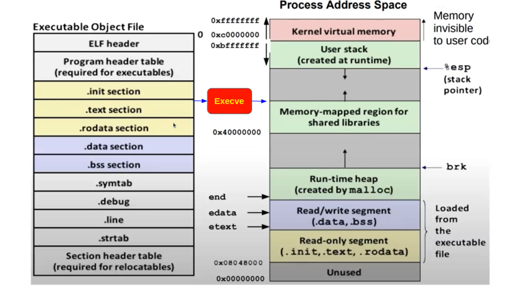

# INIT

boot ROM -> BIOS/UEFI -> MBR/GPT -> GRUB -> Kernel -> Init

1. kernel startup decompresses the kernel image and initializes the kernel data structures calling the `start_kernel` function.
2. at the end of the kernel initialization, `start_kernel` calls the `rest_init` function.
3. `rest_init` creates a kernel thread called `kernel_init` and then calls the `kernel_thread` function to start the `init` process.

   ```bash
    $ps -ef
    UID          PID    PPID  C STIME TTY          TIME CMD
    root           1       0  0 00:30 ?        00:00:01 /sbin/init splash
    root           2       0  0 00:30 ?        00:00:00 [kthreadd]
   ```  

4. `init` and `systemd` are the first user-space processes started by the kernel so the parent process ID (PPID) of both processes is 0.
5. The `init` process will be up and running as long as the system is up and running.

## runlevels

A runlevel is a mode of operation in the Linux operating system. Each runlevel has a certain number of services stopped or started, giving the user control over the behavior of the machine. Conventionally, seven runlevels exist, numbered from zero to six.

Here's what each runlevel represents:

- `0`: Halt the system.
- `1`: Single-user mode (useful for administrative tasks).
- `2`: Multi-user mode without networking.
- `3`: Multi-user mode with networking.
- `4`: Undefined.
- `5`: Multi-user mode with networking and GUI.
- `6`: Reboot the system.

The default runlevel is defined in the `/etc/inittab` file for SysV init, or in the `/etc/systemd/system` directory for systemd. The concept of runlevels applies to the System V-style init process, but is less used in systems with systemd, which uses 'targets' instead of runlevels.

## A boot system script == a startup script == an init script

- a script that is automatically run during the startup (boot) process.
- These scripts are used to start, stop, or restart system services, such as a web server, database server, or network manager.

In traditional System V-style init systems, these scripts are typically located in the `/etc/init.d/` directory and are run at the appropriate runlevel during system startup. Each script corresponds to a single system service and includes case statements to handle start, stop, restart, and status commands.

In newer systemd-based systems, these scripts are replaced by service units, which are configuration files located in the `/etc/systemd/system/` directory. These files define how to start, stop, or restart services, but they use a declarative syntax instead of a script format.

## tty(teletypewriter)

- `alt + ctrl + f?` to navigate between tty's and `alt + ctrl + f7` to go back to the one operates the GUI.
- use `ps -ef` to see the tty of a process
- `tty` command to see the tty of the current shell
- each `tty` can generate numerous `pts` (pseudo-terminal slave) devices, which are used by terminal emulator.

   ```bash
   # GUI tty
   $ tty
   /dev/pts/0
   ```

## what is a shell?

A shell is a program that takes commands from the keyboard and gives them to the operating system to perform.

## command

- it's an elf file that is executed by the kernel.
- it may be dinamically or statically linked.
Apologies for the confusion. Here's a more concise explanation of the difference between dynamically linked and statically linked programs:

| Dynamically Linked | Statically Linked |
|--------------------|-------------------|
| Programs are linked to libraries at runtime. | Programs are linked to libraries at compile time. |
| They're smaller and can share libraries. | They're larger and standalone. |
| They require the correct libraries to be installed on the system. | They don't benefit from library updates unless recompiled. |

  ```bash
   $ gcc -static myfile.c -o myfile
   # dainamically linked at least with libc
   $ gcc         myfile.c -o myfile
  ```

**elf file contains:**

1. ELF header: contains information about the file, such as the architecture, endianness, and entry point.
2. .init section: contains code that is executed before the program starts.
3. .text section: contains the program's executable code.
4. .data section: contains initialized data.
5. .bss section: contains uninitialized data.
6. .rodata section: contains read-only data.
7. .symtab section: contains symbol table information.
8. .strtab section: contains string table information.
9. .debug section: contains debugging information.



**execve()**
system call
is used to execute a program.
It replaces the current process with a new process,
loading the program into memory
and starting its execution.

**memory mapped regions for shared libraries** pointers to the shared libraries.

### Read data in elf file

```bash
   $ readelf -a a.out 
   #entry point address: 0x10a0
   $ objdump -D a.out | grep $entryPointAddress
      00000000000010a0 <_start>:
      10a0: f3 0f 1e fa          endbr64
   $ file a.out 
      a.out: ELF 64-bit LSB pie executable, x86-64, version 1 (SYSV), dynamically linked, interpreter /lib64/ld-linux-x86-64.so.2, BuildID[sha1]=96b96b20cc8c5ef78340d7f99eab79188e7338f3, for GNU/Linux 3.2.0, not stripped
```

```bash
$ g++ main.cpp -static -o staticallyLinked.out

$ file staticallyLinked.out 
staticallyLinked.out: ELF 64-bit LSB executable, x86-64, version 1 (GNU/Linux), statically linked, BuildID[sha1]=0046cb01e37826517fe7159c9842df6859b429bf, for GNU/Linux 3.2.0, not stripped

$ strace ./staticallyLinked.out 
execve("./staticallyLinked.out", ["./staticallyLinked.out"], 0x7ffe9b3cce50 /* 57 vars */) = 0
arch_prctl(0x3001 /* ARCH_??? */, 0x7ffd5977bc40) = -1 EINVAL (Invalid argument)
brk(NULL)                               = 0x1f71000
brk(0x1f71e00)                          = 0x1f71e00
arch_prctl(ARCH_SET_FS, 0x1f71400)      = 0
set_tid_address(0x1f716d0)              = 12142
set_robust_list(0x1f716e0, 24)          = 0
rseq(0x1f71da0, 0x20, 0, 0x53053053)    = 0
uname({sysname="Linux", nodename="lat", ...}) = 0
prlimit64(0, RLIMIT_STACK, NULL, {rlim_cur=8192*1024, rlim_max=RLIM64_INFINITY}) = 0
readlink("/proc/self/exe", "/home/hala/Documents/trash/stati"..., 4096) = 47
getrandom("\xe3\xb9\xd4\xa7\x8c\x54\x69\x75", 8, GRND_NONBLOCK) = 8
brk(0x1f92e00)                          = 0x1f92e00
brk(0x1f93000)                          = 0x1f93000
mprotect(0x5cc000, 45056, PROT_READ)    = 0
futex(0x5da69c, FUTEX_WAKE_PRIVATE, 2147483647) = 0
futex(0x5da6a8, FUTEX_WAKE_PRIVATE, 2147483647) = 0
newfstatat(1, "", {st_mode=S_IFCHR|0620, st_rdev=makedev(0x88, 0), ...}, AT_EMPTY_PATH) = 0
write(1, "test file for reading .elf", 26test file for reading .elf) = 26
exit_group(0)                           = ?
+++ exited with 0 +++

$ ldd staticallyLinked.out 
   not a dynamic executable
```

```bash
$ g++ main.cpp -o dynamicallyLinked.out

# interpreter /lib64/ld-linux-x86-64.so.2 is used to load the program into memory and start its execution.
# loader at line 242.
$ file dynamicallyLinked.out 
dynamicallyLinked.out: ELF 64-bit LSB pie executable, x86-64, version 1 (SYSV), dynamically linked, interpreter /lib64/ld-linux-x86-64.so.2, BuildID[sha1]=96b96b20cc8c5ef78340d7f99eab79188e7338f3, for GNU/Linux 3.2.0, not stripped

# all the shared libraries that the program is linked to are loaded into memory when the program is executed within memory-mapped regions.
$ strace ./dynamicallyLinked.out 
   execve("./dynamicallyLinked.out", ["./dynamicallyLinked.out"], 0x7ffd2b33c620 /* 57 vars */) = 0
   brk(NULL)                               = 0x55e4dd54c000
   arch_prctl(0x3001 /* ARCH_??? */, 0x7ffe892a0030) = -1 EINVAL (Invalid argument)
   mmap(NULL, 8192, PROT_READ|PROT_WRITE, MAP_PRIVATE|MAP_ANONYMOUS, -1, 0) = 0x7f8cb509e000
   access("/etc/ld.so.preload", R_OK)      = -1 ENOENT (No such file or directory)
   openat(AT_FDCWD, "/etc/ld.so.cache", O_RDONLY|O_CLOEXEC) = 3
   newfstatat(3, "", {st_mode=S_IFREG|0644, st_size=73203, ...}, AT_EMPTY_PATH) = 0
   mmap(NULL, 73203, PROT_READ, MAP_PRIVATE, 3, 0) = 0x7f8cb508c000
   close(3)                                = 0
   openat(AT_FDCWD, "/lib/x86_64-linux-gnu/libstdc++.so.6", O_RDONLY|O_CLOEXEC) = 3
   read(3, "\177ELF\2\1\1\3\0\0\0\0\0\0\0\0\3\0>\0\1\0\0\0\0\0\0\0\0\0\0\0"..., 832) = 832
   newfstatat(3, "", {st_mode=S_IFREG|0644, st_size=2260296, ...}, AT_EMPTY_PATH) = 0
   mmap(NULL, 2275520, PROT_READ, MAP_PRIVATE|MAP_DENYWRITE, 3, 0) = 0x7f8cb4e60000
   mprotect(0x7f8cb4efa000, 1576960, PROT_NONE) = 0
   mmap(0x7f8cb4efa000, 1118208, PROT_READ|PROT_EXEC, MAP_PRIVATE|MAP_FIXED|MAP_DENYWRITE, 3, 0x9a000) = 0x7f8cb4efa000
   mmap(0x7f8cb500b000, 454656, PROT_READ, MAP_PRIVATE|MAP_FIXED|MAP_DENYWRITE, 3, 0x1ab000) = 0x7f8cb500b000
   mmap(0x7f8cb507b000, 57344, PROT_READ|PROT_WRITE, MAP_PRIVATE|MAP_FIXED|MAP_DENYWRITE, 3, 0x21a000) = 0x7f8cb507b000
   mmap(0x7f8cb5089000, 10432, PROT_READ|PROT_WRITE, MAP_PRIVATE|MAP_FIXED|MAP_ANONYMOUS, -1, 0) = 0x7f8cb5089000
   close(3)                                = 0
   openat(AT_FDCWD, "/lib/x86_64-linux-gnu/libc.so.6", O_RDONLY|O_CLOEXEC) = 3
   read(3, "\177ELF\2\1\1\3\0\0\0\0\0\0\0\0\3\0>\0\1\0\0\0P\237\2\0\0\0\0\0"..., 832) = 832
   pread64(3, "\6\0\0\0\4\0\0\0@\0\0\0\0\0\0\0@\0\0\0\0\0\0\0@\0\0\0\0\0\0\0"..., 784, 64) = 784
   pread64(3, "\4\0\0\0 \0\0\0\5\0\0\0GNU\0\2\0\0\300\4\0\0\0\3\0\0\0\0\0\0\0"..., 48, 848) = 48
   pread64(3, "\4\0\0\0\24\0\0\0\3\0\0\0GNU\0\226 \25\252\235\23<l\274\3731\3540\5\226\327"..., 68, 896) = 68
   newfstatat(3, "", {st_mode=S_IFREG|0755, st_size=2220400, ...}, AT_EMPTY_PATH) = 0
   pread64(3, "\6\0\0\0\4\0\0\0@\0\0\0\0\0\0\0@\0\0\0\0\0\0\0@\0\0\0\0\0\0\0"..., 784, 64) = 784
   mmap(NULL, 2264656, PROT_READ, MAP_PRIVATE|MAP_DENYWRITE, 3, 0) = 0x7f8cb4c37000
   mprotect(0x7f8cb4c5f000, 2023424, PROT_NONE) = 0
   mmap(0x7f8cb4c5f000, 1658880, PROT_READ|PROT_EXEC, MAP_PRIVATE|MAP_FIXED|MAP_DENYWRITE, 3, 0x28000) = 0x7f8cb4c5f000
   mmap(0x7f8cb4df4000, 360448, PROT_READ, MAP_PRIVATE|MAP_FIXED|MAP_DENYWRITE, 3, 0x1bd000) = 0x7f8cb4df4000
   mmap(0x7f8cb4e4d000, 24576, PROT_READ|PROT_WRITE, MAP_PRIVATE|MAP_FIXED|MAP_DENYWRITE, 3, 0x215000) = 0x7f8cb4e4d000
   mmap(0x7f8cb4e53000, 52816, PROT_READ|PROT_WRITE, MAP_PRIVATE|MAP_FIXED|MAP_ANONYMOUS, -1, 0) = 0x7f8cb4e53000
   close(3)                                = 0
   openat(AT_FDCWD, "/lib/x86_64-linux-gnu/libm.so.6", O_RDONLY|O_CLOEXEC) = 3
   read(3, "\177ELF\2\1\1\3\0\0\0\0\0\0\0\0\3\0>\0\1\0\0\0\0\0\0\0\0\0\0\0"..., 832) = 832
   newfstatat(3, "", {st_mode=S_IFREG|0644, st_size=940560, ...}, AT_EMPTY_PATH) = 0
   mmap(NULL, 942344, PROT_READ, MAP_PRIVATE|MAP_DENYWRITE, 3, 0) = 0x7f8cb4b50000
   mmap(0x7f8cb4b5e000, 507904, PROT_READ|PROT_EXEC, MAP_PRIVATE|MAP_FIXED|MAP_DENYWRITE, 3, 0xe000) = 0x7f8cb4b5e000
   mmap(0x7f8cb4bda000, 372736, PROT_READ, MAP_PRIVATE|MAP_FIXED|MAP_DENYWRITE, 3, 0x8a000) = 0x7f8cb4bda000
   mmap(0x7f8cb4c35000, 8192, PROT_READ|PROT_WRITE, MAP_PRIVATE|MAP_FIXED|MAP_DENYWRITE, 3, 0xe4000) = 0x7f8cb4c35000
   close(3)                                = 0
   openat(AT_FDCWD, "/lib/x86_64-linux-gnu/libgcc_s.so.1", O_RDONLY|O_CLOEXEC) = 3
   read(3, "\177ELF\2\1\1\0\0\0\0\0\0\0\0\0\3\0>\0\1\0\0\0\0\0\0\0\0\0\0\0"..., 832) = 832
   newfstatat(3, "", {st_mode=S_IFREG|0644, st_size=125488, ...}, AT_EMPTY_PATH) = 0
   mmap(NULL, 127720, PROT_READ, MAP_PRIVATE|MAP_DENYWRITE, 3, 0) = 0x7f8cb4b30000
   mmap(0x7f8cb4b33000, 94208, PROT_READ|PROT_EXEC, MAP_PRIVATE|MAP_FIXED|MAP_DENYWRITE, 3, 0x3000) = 0x7f8cb4b33000
   mmap(0x7f8cb4b4a000, 16384, PROT_READ, MAP_PRIVATE|MAP_FIXED|MAP_DENYWRITE, 3, 0x1a000) = 0x7f8cb4b4a000
   mmap(0x7f8cb4b4e000, 8192, PROT_READ|PROT_WRITE, MAP_PRIVATE|MAP_FIXED|MAP_DENYWRITE, 3, 0x1d000) = 0x7f8cb4b4e000
   close(3)                                = 0
   mmap(NULL, 8192, PROT_READ|PROT_WRITE, MAP_PRIVATE|MAP_ANONYMOUS, -1, 0) = 0x7f8cb4b2e000
   arch_prctl(ARCH_SET_FS, 0x7f8cb4b2f3c0) = 0
   set_tid_address(0x7f8cb4b2f690)         = 10570
   set_robust_list(0x7f8cb4b2f6a0, 24)     = 0
   rseq(0x7f8cb4b2fd60, 0x20, 0, 0x53053053) = 0
   mprotect(0x7f8cb4e4d000, 16384, PROT_READ) = 0
   mprotect(0x7f8cb4b4e000, 4096, PROT_READ) = 0
   mprotect(0x7f8cb4c35000, 4096, PROT_READ) = 0
   mmap(NULL, 8192, PROT_READ|PROT_WRITE, MAP_PRIVATE|MAP_ANONYMOUS, -1, 0) = 0x7f8cb4b2c000
   mprotect(0x7f8cb507b000, 45056, PROT_READ) = 0
   mprotect(0x55e4dd4aa000, 4096, PROT_READ) = 0
   mprotect(0x7f8cb50d8000, 8192, PROT_READ) = 0
   prlimit64(0, RLIMIT_STACK, NULL, {rlim_cur=8192*1024, rlim_max=RLIM64_INFINITY}) = 0
   munmap(0x7f8cb508c000, 73203)           = 0
   getrandom("\x32\x23\x11\x23\x99\x9b\x1f\xf2", 8, GRND_NONBLOCK) = 8
   brk(NULL)                               = 0x55e4dd54c000
   brk(0x55e4dd56d000)                     = 0x55e4dd56d000
   futex(0x7f8cb508977c, FUTEX_WAKE_PRIVATE, 2147483647) = 0
   newfstatat(1, "", {st_mode=S_IFCHR|0620, st_rdev=makedev(0x88, 0), ...}, AT_EMPTY_PATH) = 0
   write(1, "test file for reading .elf", 26test file for reading .elf) = 26
   exit_group(0)                           = ?
   +++ exited with 0 +++
   hala@lat:~/Documents/trash
   $ ldd 
   dynamicallyLinked.out  main.cpp               

   # ldd command shows the shared libraries that the program is linked to.
$ ldd dynamicallyLinked.out 
   linux-vdso.so.1 (0x00007fff6d507000)
   libstdc++.so.6 => /lib/x86_64-linux-gnu/libstdc++.so.6 (0x00007f63a84c7000)
   libc.so.6 => /lib/x86_64-linux-gnu/libc.so.6 (0x00007f63a829e000)
   libm.so.6 => /lib/x86_64-linux-gnu/libm.so.6 (0x00007f63a81b7000)
   /lib64/ld-linux-x86-64.so.2 (0x00007f63a870c000)
   libgcc_s.so.1 => /lib/x86_64-linux-gnu/libgcc_s.so.1 (0x00007f63a8197000)
```

### interpreter loader

```bash
#[Requesting program interpreter: /lib64/ld-linux-x86-64.so.2]
$ readelf -l dynamicallyLinked.out 

   Elf file type is DYN (Position-Independent Executable file)
   Entry point 0x10a0
   There are 13 program headers, starting at offset 64

   Program Headers:
     Type           Offset             VirtAddr           PhysAddr
                    FileSiz            MemSiz              Flags  Align
     PHDR           0x0000000000000040 0x0000000000000040 0x0000000000000040
                    0x00000000000002d8 0x00000000000002d8  R      0x8
     INTERP         0x0000000000000318 0x0000000000000318 0x0000000000000318
                    0x000000000000001c 0x000000000000001c  R      0x1
         [Requesting program interpreter: /lib64/ld-linux-x86-64.so.2]
     LOAD           0x0000000000000000 0x0000000000000000 0x0000000000000000
                    0x00000000000007b8 0x00000000000007b8  R      0x1000
     LOAD           0x0000000000001000 0x0000000000001000 0x0000000000001000
      ....
```

**while running dynamically linked program:**

1. The kernel starts the process by calling the `execve()` system call.
2. The kernel recognizes the file as an ELF file and finds the dynamic linker specified in the ELF header.
3. The kernel sets up a new address space for the process, loads the dynamic linker into memory, and transfers control to it.
4. The dynamic linker reads the program's dynamic section to find out which shared libraries it needs. This section contains a list of names of required libraries.
5. For each required library, the dynamic linker first checks if the library is already loaded into memory (due to being used by another program). If it is, the dynamic linker reuses the existing copy. If not, the dynamic linker loads the library into memory.
6. The dynamic linker uses the `mmap()` system call to map the shared libraries into the process's address space.
7. The dynamic linker resolves symbols (function and variable references) in the program that refer to the shared libraries. It updates the program's GOT (Global Offset Table) and PLT (Procedure Linkage Table) so that they point to the correct addresses in the shared libraries.
8. Once all symbols are resolved and libraries are loaded, the dynamic linker transfers control to the program's main function.
